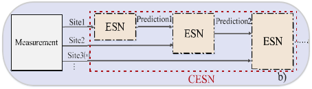

# CESN



## Environment

- Numpy,

- [ESN](../ESN/ESN.py)

## Citation
If you find our work useful in your research, please consider citing: 
```
@article{li2020spatio,
  title={Spatio-temporal modeling with enhanced flexibility and robustness of solar irradiance prediction: a chain-structure echo state network approach},
  author={Li, Qian and Wu, Zhou and Zhang, Haijun},
  journal={Journal of Cleaner Production},
  volume={261},
  pages={121151},
  year={2020},
  publisher={Elsevier}
}
```