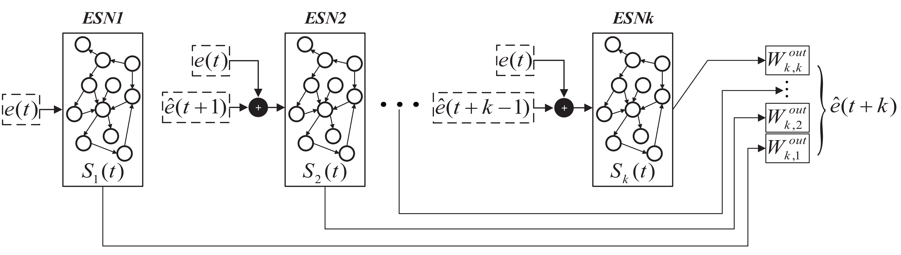

# DCESN



## Environment

- Numpy,

- [ESN](../ESN/ESN.py)

## Citation
If you find our work useful in your research, please consider citing: 
```
@article{jiang2022deep,
  title={Deep-chain echo state network with explainable temporal dependence for complex building energy prediction},
  author={Jiang, Ruiqi and Zeng, Shaoxiong and Song, Qing and Wu, Zhou},
  journal={IEEE Transactions on Industrial Informatics},
  volume={19},
  number={1},
  pages={426--435},
  year={2022},
  publisher={IEEE}
}
```