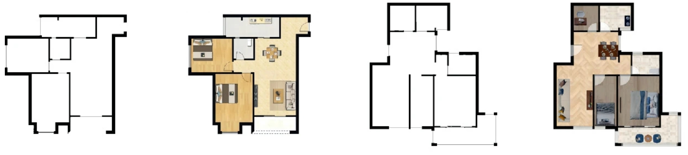
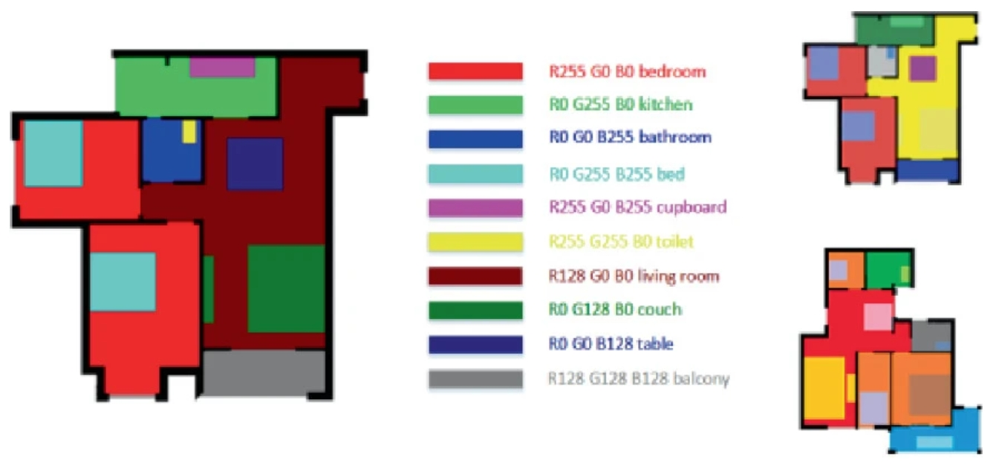

# Building Design Dataset

This dataset is collected from different online platforms, and pre-processed by Xiaolong Jia.


    │
    ├─Layout(Sketch2Layout)
    │  │
    │  ├─Layout
    │  │
    │  └─Sketch
    │
    ├─Style(Layout2Design)
    │	│
    │	├─Layout
    │	│
    │	└─Sketch
    │
    └─README.md


## The Examples

The sketches and drawings


The label


## Citation
Paper considered citing: 
```
@inproceedings{jia2023multi,
  title={A Multi-style Interior Floor Plan Design Approach Based on Generative Adversarial Networks},
  author={Jia, Xiaolong and Jiang, Ruiqi and Qi, Hongtuo and Liu, Jiepeng and Wu, Zhou},
  booktitle={International Conference on Neural Computing for Advanced Applications},
  pages={491--506},
  year={2023},
  organization={Springer}
}
```